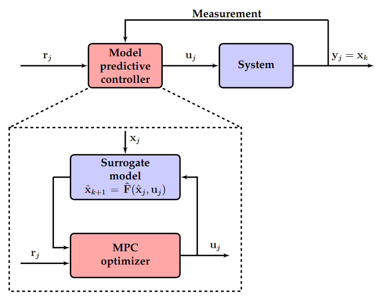

# Model Predictive Control for Extrusion Additive Manufacturing 

> Originally published to https://github.com/jakeread/mpc-for-additive-extrusion on March 10th, 2025 

> I hereby dedicate the contents of this disclosure to the public domain so that it may serve as prior art.  

One of the key challenges when controlling extrusion based additive manufacturing equipment is to generate precise flowrates the nozzle, so that the width of the extruded track is geometrically accurate. This is especially challenging when a machine is changing speed and direction rapidly, because material flows have dynamical properties: filament in Fused Filament Fabrication (FFF) machines compress before they exit the nozzle, as do melt flows in pellet extruder, and gels and clays in syringe extruders. Without compensation for these effects, machines tend to under-extrude when they accelerate and over-extrude when they slow down. It is also difficult to know how fast a material can be extruded under different process parameters: when nozzle geometries, temperatures, or material compositions change, all of the extrudate's dynamic and static properties change along with it, presenting a challenge to machine builders and users. 

  
> A diagram of an FFF printer's basic phenomena. Filament between the drive gear and nozzle is compressible, leading to some nasty extrusion dynamics. Extrusion is further complicated by nonlinear shear thinning of materials, die swell of extrudate processed at high pressures, and many more parameters.  While this disclosure largely discusses FFF printing, the principles can be easily applied to pellet extruders, syringe extruders, pump extruders, etc - just about anything where a flow can be modelled and controlled. 


> Poorly understood filament dynamics can lead to extrusion errors when machines turn corners or slow down and speed up. A common heuristic remedy for this problem is known as 'linear advance,' but it is difficult to tune and misses nonlinear properties of extrudate flow dynamics. [via the Prusa Knowledge Base](https://help.prusa3d.com/article/linear-advance_2252)

Lots of work is being done to model these processes and dynamics, and I have included some references to that work in the references section of this document. These predictive models allow us to simulate a virtual extruder over a given time span using a set of control inputs to the system (and an initial state), to generate a simulated time-series of resulting flowrates. 

  
> Above is a steady-state model of melt flow generated for an FFF machine, using instrumentation on the machine. This is from my own prior work [here](https://link.springer.com/article/10.1007/s40192-024-00350-w) [pdf](assets/s40192-024-00350-w.pdf). Models like this do not contain dynamics information, but they can be incorporated into dynamical models. 

Predictive models make way for predictive controllers; Model Predictive Control (MPC) is a strategy common in robotics but seldom applied in manufacturing equipment. I will not go into detail on MPC in this disclosure since it is very well understood in the controls community... in brief, MPC does what people do when doing dynamics: continually predict outcomes of a set of candidate actions, optimizes those actions so that the outcome is 'the best,' then issues the first of those actions, and begins the process again. 

MPC is computationally intensive, because for each iteration we need to run the simulation through multiple time steps, and we typically need to take many iterations of possible control values to converge to an optimal solution. 

|  |  |
| --- | --- |

> Classic MPC Formulations  
> Brunton, Steven L, and J Nathan Kutz. 2022a. “Chapter 10: Data Driven Control.” In Data-Driven Science and Engineering: Machine Learning, Dynamical Systems, and Control, 389-408. Cambridge, United Kingdom: Cambridge University Press.  

In additive manufacturing, controllers face the challenge of depositing extrudate precisely while also moving the machine carefully along a path. The process is limited by the machines' motion dynamics as well as dynamics of the extrudate flow, but both can be modeled and simulated. Indeed, models for motion given input motor torques or voltages are the most commonly deployed in MPC literature.

It is possible to formulate a cost function for extrusion machines: probably we want to print quickly (minimizing time) and also accurately (minimizing geometric error). However, cost functions can be authored to express many desired outcomes, and can be tuned to bias particular properties (like speed) trading off for others (like precision). For this reason, MPC controllers will allow additive machines to express more human-friendly interfaces for parameter tuning. 

If we can bring enough compute power to our machine controllers for additive, MPC becomes an obvious solution. With recent advances in flexible compute libraries for optimization, and availability of high power computing at both high- and low levels, this is now becoming the case. I have been working on this for approximately the last six months, aided especially by a handful of hugely performant open software packages that have made it easier to assemble and run MPC. 

  
  
> This is a plot (video linked above) generated from the online optimizer I have written that solves for optimal control inputs to an FFF printer's motion system and polymer flow simultaneously, using models as described below. At left, we see the simulated trajectory, with arrows color-coded to resulting velocity at each time step and with target extrusion (light grey) with resulting extrusion (dark grey). This simulation is differentiable with respect to a cost function that describes optimal control outputs as those which maximize printer velocity while minimizing errors. At right, various output plots from the same simulation; errors (top), solver gradients, solver torques (middle) and velocities (bottom). The solve is done over a quarter-second receding horizon window, with one time-step’s control outputs (4 milliseconds long) issued each cycle. 

```python
def integrate_flow(torque, inflow, pres, del_t):
	k_outflow = 2.85        # outflow = pres*k_outflow 
	k_tq = 1                # torque scalar, 
	k_pushback = 10         # relates pressure to torque 
	k_fric = 0.2            # damping 

	torque = np.clip(torque, -1, 1)

	# calculate force at top (inflow) and integrate for new inflow 
	force_in = torque * k_tq - inflow * k_fric - np.clip(pres, 0, np.inf) * k_pushback
	inflow = inflow + force_in * del_t

	# outflow... related to previous pressure, is just proportional 
	outflow = pres * k_outflow

	# pressure... rises w/ each tick of inflow, drops w/ outflow, 
	pres = pres + inflow * del_t - outflow * del_t

	# that's all for now?
	return outflow, inflow, pres 
```

```python
def integrate_pos(torques, vel, pos, del_t):
	params_torques = jnp.array([2000, 1000]) # motor juice per-axis 
	params_frictional = jnp.array([2, 2])	 # damping 

	torques = jnp.clip(torques, -1, 1)
	torques = torques * params_torques

	acc = torques - params_frictional * vel 
	vel = vel + acc * del_t 
	pos = pos + vel * del_t 

	return acc, vel, pos
```

> Above are two simple models that I have used for MPC based control of an FFF printer system, as they are articulated to the solver (as generic python functions). MPC models can be expressed in many forms, and deployed by many different types of computing systems. Normally they are compiled from symbolic representations. 

Models can additionally be built from data collected on machine (or offline), which takes care of the biggest challenge in MPC - making the models. 

  
> Above, a linear compression model fit from data generated on an FFF printer. This is a simple model, outlined below.

$\dot{P} = Q_{in} - Q_{out}$  
$Q_{out} = Pk_{outflow}$  
$F_{in} = Tk_{tq} - Pk_{pushback} - Q_{in}k_{fric}$  
$\dot{Q}_{in} = F_{in}$  

Values: 

- $Q_{out}$ is outflow (at nozzle)
- $Q_{in}$ is inflow (at motor)
- $P$ is 'pressure' in the chamber: is equivalent here to cubic millimeters of
  un-extruded filament in the chamber
- $F_{in}, Q_{in}$ are force and velocity for the filament (at the motor)

Parameters:

- $k_{outflow}$ relates pressure to flow (and could become a function)
- $k_{tq}$ scales torque
- $k_{pushback}$ relates pressure to force (at motor)
- $k_{fric}$ is classic damping friction on the filament

<br>  
  
  
> Above, an extrusion model fit from the same data, but this time using a small neural network to predict flows given extruder velocity states. Many forms of model can be used in MPC, but most MPC optimizers require that they be differentiable. 

This is possible using many different computing architectures, but in my deployment it has been really valuable to split the MPC controller (which runs on a "big cpu/gpu") from the embedded systems that execute control outputs. The latter basically just follow spline segments and other time-encoded commands, and there is some slush between time domains - that is to say that I have developed the networking systems such that we don't have extremely punishing time constraints. Offloading MPC to a "big cpu/gpu" (rather than compiling it for a target embedded device) has also made it possible to rapidly develop and test models, cost functions, and solvers. 

## Online Updating of Models

As we operate machines, we can generate new data. Using a suitable compute architecture it is possible to recompile or modify an MPC controller while another instance of the same is running (or while the system is paused), and swap the controllers in the middle of a print. 

  
> With flexible enough control architecture, it is possible to update MPC controllers continuously during a print - although it is probably most practical to do this when the machine can be momentarily paused. In some formulations, an MPC controller may simply expose model parameters that can be adjusted on the fly. However, the most performant MPC systems are compiled using constant model parameters. In cases where recompiling is preferred, a control system could bring a new controller online while another is operating, and then swap the controller in by redirecting dataflows when the switch is appropriate. 

This would be advantagous in extrusion machines that can measure the data needed to generate and fit the models used in their controllers, because it would allow them to adapt to changing material or processing conditions. Large changes to models could also be used to indicate to the machine that something may have gone wrong, and that user intervention is needed. 

## State of Development 

I have authored one such MPC controller that solves flow and motion for an FFF printer, using models fit from data measured on the same machine. The optimizer runs in a performant manner (solving in 250 microseconds for 250 milliseconds of lookahead), and it can output control values in real-time to the machine's actuators. I have developed versions that use simple linear models for flow and more complex models using neural networks. I am actively working on the project, and hope to release source code and show more complete examples when the time is right. 

## Enumerations 

The compute intensity of MPC controllers make them difficult to deploy when models become complex. Although the availability of compute is increasing, this may still be a limit for some systems, i.e. inexpensive ones. In these cases, it should be possible to distill an MPC controller into a smaller policy controller that can generate control outputs in fewer iterations. To build such a system, one would train a policy based on outputs generated from a complete, precise MPC controller that is run through an array of simulations that represent typical manufacturing jobs. 

It is also possible to use MPC control for subsets of the additive extrusion machine control problem. For example, motion control using simple heuristics is very common and extremely performant; it may be best to use those controllers for the motion component of an additive machine (although governed by maximal steady-state flows, and maximal extrusion accelerations), and then use an MPC controller just for the extrusion component of control, which is more complex and difficult to articulate using heuristics alone. 

Models *do not* need to be generated on the machine where they are used. They can be developed on specialized test equipment and deployed on cheaper equipment. It is nonetheless valuable to be able to validate them in-situ. 

While this disclosure discusses extrusion based manufacturing and FFF in particular, the principles can be deployed on all styles of extruder. It is likely that similar systems can work for other processing tasks, namely welding, although changes would need to be made to the constitutive models and cost functions. With more adaptions, similar systems can likely be developed for CNC machining and turning, although cutting models may be substantially more complex - they may also turn out to be simpler. 

## References 

I discussed these topics during my thesis proposal *on December 12th, 2024* which is included here as a [PDF](assets/jake-read-mit-thesis-proposal.pdf) and available from MIT archives on request. Slides for the proposal are public [here](https://jakeread.github.io/slides/2024-12_proposal/2024-12_proposal.html) and the proposal site is public [here](https://jakeread.github.io/thesis-proposal/) 

### Efforts to Model Extrusion Dynamics

> Mackay, Michael E. 2018. “The Importance of Rheological Behavior in the Additive Manufacturing Technique Material Extrusion.” Journal of Rheology 62 (6): 1549–61. 

> Coogan and Kazmer. 2020. “Prediction of Interlayer Strength in Material Extrusion Additive Manufacturing.” Additive Manufacturing 35: 101368

> Turner, Brian N, Robert Strong, and Scott A Gold. 2014. “A Review of Melt Extrusion Additive Manufacturing Processes: I. Process Design and Modeling.” Rapid Prototyping Journal 20 (3): 192–204. 

> Go, Jamison, Scott N Schiffres, Adam G Stevens, and A John Hart. 2017. “Rate Limits of Additive Manufacturing by Fused Filament Fabrication and Guidelines for High-Throughput System Design.” Additive Manufacturing 16: 1–11. 

> Mackay, Michael E, Zachary R Swain, Colby R Banbury, David D Phan, and David A Edwards. 2017. “The Performance of the Hot End in a Plasticating 3D Printer.” Journal of Rheology 61 (2): 229–36.

### The Most Relevant Efforts w/r/t Extrudate Dynamics and Control 

> Kazmer, David O., Austin R. Colon, Amy M. Peterson, and Sun Kyoung Kim. 2021. “Concurrent Characterization of Compressibility and Viscosity in Extrusion-Based Additive Manufacturing of Acrylonitrile Butadiene Styrene with Fault Diagnoses.” Additive Manufacturing 46 (October): 102106. https://doi.org/10.1016/j.addma.2021.102106. 

> Wu, Pinyi. 2024. “Modeling and Feedforward Deposition Control in Fused Filament Fabrication.”

### MPC from the Controls Bible 

> Brunton, Steven L, and J Nathan Kutz. 2022a. “Chapter 10: Data Driven Control.” In Data-Driven Science and Engineering: Machine Learning, Dynamical Systems, and Control, 389-408. Cambridge, United Kingdom: Cambridge University Press.

### MPC in Robotics 

> Di Carlo, Jared, Patrick M Wensing, Benjamin Katz, Gerardo Bledt, and Sangbae Kim. 2018. “Dynamic Locomotion in the Mit Cheetah 3 Through Convex Model-Predictive Control.” In 2018 IEEE/RSJ International Conference on Intelligent Robots and Systems (IROS), 1-9. IEEE.

> Torrente, Guillem, Elia Kaufmann, Philipp Föhn, and Davide Scaramuzza. 2021. “Data-Driven MPC for Quadrotors.” IEEE Robotics and Automation Letters 6 (2): 3769-76.

> Kuindersma, Scott, Robin Deits, Maurice Fallon, Andrés Valenzuela, Hongkai Dai, Frank Permenter, Twan Koolen, Pat Marion, and Russ Tedrake. 2016. “Optimization-Based Locomotion Planning, Estimation, and Control Design for the Atlas Humanoid Robot.” Autonomous Robots 40: 429-55. 